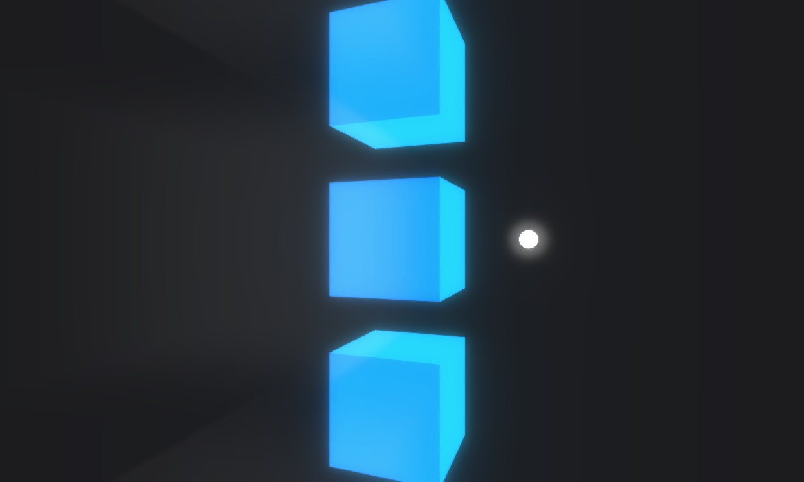

# URP Sun Shafts
A URP port of Unity's classic Standard Assets Effects package's Sun Shaft effect.

The effect can be subtle, but when done well can add some much needed vibrancy to a scene.

## Heads Up
This asset was created with URP 10.4.0, but it *should* work on any version of URP that has custom renderer feature capabilities.

## Install
Download the latest version from [Releases](https://github.com/ryanslikesocool/URP-Sun-Shafts/releases/tag/v1.0).\
Open the Unity project you want the package installed in.\
Open the package to install into the project's Plugins folder.

## Usage
In your Forward Renderer asset, add the Sun Shafts render feature.

- `Pass Event` controls when the feature will render.  Leave this at `Before Rendering Post Processing` if you're not doing anything wacky with the rendering order.
- `Sun Shaft Material` is the material used for the effect.  Assign URP Sun Shafts material to the field, located in `Plugins/URP Sun Shafts/Materials` by default

- `Render Mode` controls how the effect is created.  Depth mode will only work if the URP asset has the depth option enabled.  Otherwise it can be created from a skybox or the camera background color.
- `Resolution` controls how large the render textures created are.  `High` is full size, `Normal` is 1/4th size, and `Low` is 1/16th size.  Lower settings will create a blurrier effect.
- `Blend Mode` controls how the effect is blended on top of the scene.  `Screen` is more subtle than `Add`.
- `Depth Threshold` controls how much depth or color difference is required for the effect to appear.  A lower value will make the effect more prominent.
- `Opacity` controls the opacity of the entire effect.

- `Sun Position` controls the position of the sun in world space.  It's recommended to put this whereever your main light is located.
- `Radial Blur Iterations` controls how many times the render texture is resampled.  A larger number will give a larger blur.
- `Sun Color` controls the color of the sun and the shafts.
- `Sun Threshold` controls what colors do not emit shafts.  For example, if set to red, any red pixels will not create the effect, but other colors will.  This takes some trial and error to get the value right.
- `Sun Blur Radius` controls how blurry the shafts will be.
- `Sun Intensity` controls how intense the sun is.
- `Max Radius` controls the maximum size of the effect relative to the screen.
